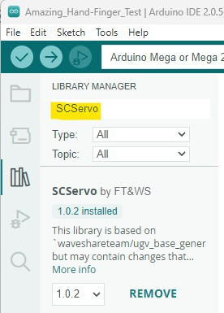
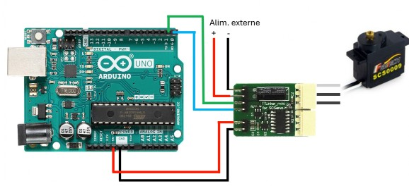
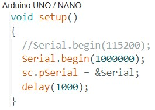
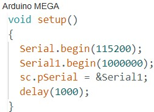

Feetech SCS0009 with Arduino tutorial :

[https://www.robot-maker.com/forum/topic/14804-presentation-et-fonctionnement-des-servomoteurs-feetech/]

Make sure to first install Arduino librairie "SCServo".

Use Feetech software to set IDs :
[https://github.com/Robot-Maker-SAS/FeetechServo/tree/main/feetech%20debug%20tool%20master/FD1.9.8.2)

# Summary in English (tutorial link is in french...)

## Wiring for link mode to change IDs of servos :

Upload Blink example program on arduino before opening serial port com with Feeetech software.

Rx arduino pin connected to Tx pin on TTLinker / Tx arduino pin connected to Rx pin on TTLinker

## Wiring for control mode with arduino :

Upload custom program on arduino board.

Rx arduino pin connected to Tx pin on TTLinker / Tx arduino pin connected to Rx pin on TTLinker

- For an arduino Uno (or other small arduinos with only one serial port), Serial communication setup need to be as follow :

- Note that Arduino used in this case is a Mega which have several serial ports embedded, so Serial communication setup need to be as follow :

Rx and Tx pin used on arduino Mega are RX1 & TX1 (19 & 18)

