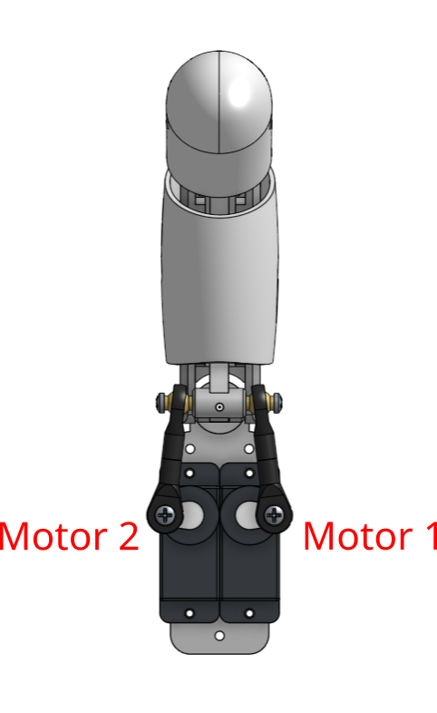
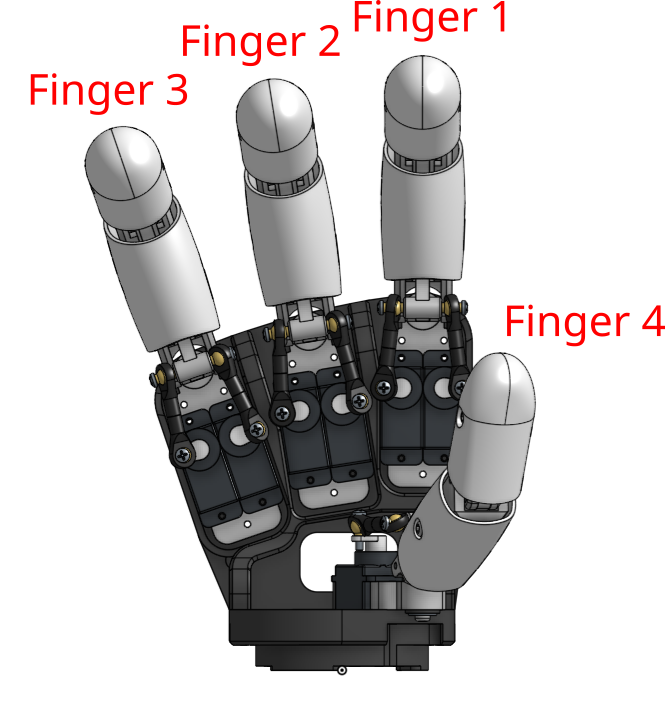

# Example control for the Pollen Robotics "AmazingHand" (a.k.a. AH!)

## How to use:
- Install Rust: https://www.rust-lang.org/tools/install
- Install uv: https://docs.astral.sh/uv/getting-started/installation/
- Install dora-rs: https://dora-rs.ai/docs/guides/Installation/installing
  - start the daemon: `dora up`

- Clone this repository and in a console from the directory run:
- `uv venv --python 3.12`
- To run the webcam hand tracking demo in simulation only:
  - `dora build dataflow_tracking_simu.yml --uv` (needs to be done only once)
  - `dora run dataflow_tracking_simu.yml --uv`
- To run the webcam hand tracking demo with real hardware:
  - `dora build dataflow_tracking_real.yml --uv` (needs to be done only once)
  - `dora run dataflow_tracking_real.yml --uv`
- To run a simple example to control the finger angles in simulation:
  - `dora build dataflow_angle_simu.yml --uv` (needs to be done only once)
  - `dora run dataflow_angle_simu.yml --uv`

## Hand Setup

Be sure to adapt the configuration file [r_hand.toml](AHControl/config/r_hand.toml) for your particular hand.
You can use the software tools located in [AHControl](AHControl).

## Details

- [AHControl](AHControl) contains a dora-rs node to control the motors, along with some useful tools to configure them.
- [AHSimulation](AHSimulation) contains a dora-rs node to simulate the hand and get the inverse kinematics.
- [HandTracking](HandTracking) contains a dora-rs node to track hands from a webcam and use it as target to control AH!.
