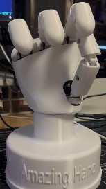

Project is licensed under [Apache 2.0](https://www.apache.org/licenses/LICENSE-2.0)


Mechanical design is licensed under a :
[Creative Commons Attribution 4.0 International License][cc-by].
[![CC BY 4.0][cc-by-image]][cc-by]
[![CC BY 4.0][cc-by-shield]][cc-by]

[cc-by]: http://creativecommons.org/licenses/by/4.0/
[cc-by-image]: https://licensebuttons.net/l/by/4.0/88x31.png
[cc-by-shield]: https://img.shields.io/badge/License-CC%20BY-lightgrey.svg


# Amazing Hand project


Robotic hands are often very expensive and not so expressive. More dexterous often needs cables and deported actuators in forearm i.e..

Aim of this project is to be able to explore humanoid hand possibilities on a real robot (and Reachy2 is the perfect candidate for that !) with moderate cost.
=> Wrist interface is designed for Reachy2's wrist (Orbita 3D), but it can be easily adapted to other robot's wrist...


Amazing Hand is :
- 8 dofs humanoid hand with 4 fingers
- 2 phalanxes per finger articulated together
- flexible shells allmost everywhere
- All actuators inside the hand, without any cables
- 3D printable
- 400g weight
- low-cost (<200€)
- open-source

[AmazingHand_Overview](/docs/AmazingHand_Overview.pdf)


Each finger is driven by parallel mechanism. 
That means 2x small Feetech SCS0009 servos are used to move each finger in flexion / extension & Abduction / Adduction


2 ways of control are available :
- Use a Serial bus driver (waveshare i.e.) + Python script
- Use an Arduino + feetech TTL Linker

Detailed explaination are available for both ways and Basic demo software is available also.
Up to you !


## Table of contents

- [Python-based Hand Tracking System](#python-based-hand-tracking-system)
    - [Features](#features)
    - [Files](#files)
    - [Quick Start](#quick-start)
    - [Command Line Options](#command-line-options)
    - [Installation](#installation)
        - [CPU Version (Default)](#cpu-version-default)
        - [GPU Version (Enhanced Performance)](#gpu-version-enhanced-performance)
    - [Simulation Mode](#simulation-mode)
    - [Testing and Troubleshooting](#testing-and-troubleshooting)
    - [Control Modes](#control-modes)
    - [Configuration](#configuration)
    - [Hardware Requirements](#hardware-requirements)
    - [GPU Performance Optimization](#gpu-performance-optimization)
- [Build Resources](#build-resources)
    - [BOM (Bill Of Materials)](#bom-bill-of-materials)
    - [CAD Files and Onshape document](#CAD-files-and-onshape-document)
    - [Assembly Guide](#assembly-guide)
    - [Run_basic_Demo](#Run-basic-Demo)
- [Disclaimer](#disclaimer)
- [AmazingHand_tracking Demo](#AmazingHand_tracking_Demo) 
- [Project Updates & Community](#project-updates--community)
    - [Updates history](#updates-history)
    - [Project posts](#project-posts)
    - [To Do List](#to-do-list)
    - [FAQ](#faq)
    - [Contact](#contact)
    - [Thank you](#thank-you)


# Python-based Hand Tracking System

A new Python-based hand tracking system has been developed that provides real-time control of the Amazing Hand using MediaPipe hand tracking and inverse kinematics.

## Features

- **Real-time Hand Tracking**: Uses MediaPipe to detect hand landmarks from video stream
- **Inverse Kinematics**: Implements curl-based IK for natural finger movement control
- **Direct Motor Control**: Communicates directly with Feetech SCS0009 servos via serial connection
- **Natural Movement**: Robot fingers mimic physical hand movements including bending and positioning
- **Configurable Parameters**: Adjustable sensitivity, movement ranges, and motor positions

## Files

- **`amazing_hand_tracker_simple.py`**: Main Python script for hand tracking and robot control
- **`scsservo_sdk/`**: Custom SDK for Feetech SCS0009 servo communication
- **`r_hand.json`**: Robot hand configuration file with motor mappings
- **`requirement_simple.txt`**: Python dependencies for the tracking system (CPU version)
- **`requirements_gpu.txt`**: GPU-accelerated dependencies for enhanced performance

## Quick Start

1. Install dependencies:
   ```bash
   pip install -r requirement_simple.txt
   ```

2. Connect the Amazing Hand to your computer via USB (COM port on Windows)

3. Run the tracking system:
   ```bash
   python amazing_hand_tracker_simple.py --port COM3
   ```

4. Show your hand to the camera - the robot fingers will follow your movements

## Command Line Options

The script supports various command line arguments for different modes and configurations:

```bash
# Basic hand tracking with robot control
python amazing_hand_tracker_simple.py --port COM3

# Simulation mode (no physical robot connection)
python amazing_hand_tracker_simple.py --simulation

# Test individual motors
python amazing_hand_tracker_simple.py --test-motors --port COM3

# Enable debug output
python amazing_hand_tracker_simple.py --port COM3 --debug

# Use advanced IK instead of curl-based IK
python amazing_hand_tracker_simple.py --port COM3 --advanced-ik

# Specify different COM port
python amazing_hand_tracker_simple.py --port COM4

# Force GPU acceleration (if available)
python amazing_hand_tracker_simple.py --port COM3 --gpu

# Help and available options
python amazing_hand_tracker_simple.py --help
```

## Installation

### Prerequisites
- Python 3.7 or higher
- Webcam for hand tracking
- USB-to-Serial converter (for physical robot connection)

### Dependencies Installation

#### CPU Version (Default)
Install all required packages:
```bash
pip install -r requirement_simple.txt
```

Or install manually:
```bash
pip install opencv-python
pip install mediapipe
pip install numpy
pip install pyserial
```

#### GPU Version (Enhanced Performance)
For better performance with GPU acceleration, install GPU-enabled versions:

**⚠️ Important**: GPU acceleration support varies by Python version:

**Python 3.11 or earlier (Full GPU acceleration):**
```bash
# CUDA-enabled OpenCV (for NVIDIA GPUs)
pip install opencv-python-cuda

# GPU-accelerated MediaPipe
pip install mediapipe-gpu

# GPU-accelerated NumPy (optional, for large calculations)
pip install cupy-cuda11x  # Replace with your CUDA version

# Other dependencies remain the same
pip install pyserial
```

**Python 3.12 (Limited GPU acceleration - Current):**
```bash
# Standard packages (GPU acceleration limited)
pip install opencv-contrib-python
pip install mediapipe
pip install pyserial

# PyTorch with CUDA (this works on Python 3.12)
pip install torch torchvision torchaudio --index-url https://download.pytorch.org/whl/cu121
```

**Note**: GPU versions require:
- NVIDIA GPU with CUDA support
- CUDA Toolkit installed
- Compatible GPU drivers
- Windows: Visual Studio Build Tools
- Linux: GCC compiler

**Performance Benefits**:
- Faster hand tracking processing
- Reduced latency for real-time control
- Better performance with high-resolution cameras
- Smoother robot hand response

### Hardware Setup
1. Connect the Amazing Hand to your computer via USB
2. Ensure external 5V power supply is connected to the servos
3. Note the COM port (e.g., COM3 on Windows, /dev/ttyUSB0 on Linux)

## Simulation Mode

For testing without physical hardware, use simulation mode:
```bash
python amazing_hand_tracker_simple.py --simulation
```

In simulation mode:
- MediaPipe hand tracking works normally
- Motor commands are simulated (no physical movement)
- Useful for testing hand detection and IK calculations
- No COM port connection required

## Testing and Troubleshooting

### Test Motor Connections
```bash
python amazing_hand_tracker_simple.py --test-motors --port COM3
```

This will:
- Test communication with each servo
- Move each finger through its range of motion
- Verify motor IDs and connections
- Display servo feedback and status

### Debug Mode
```bash
python amazing_hand_tracker_simple.py --port COM3 --debug
```

Enables:
- Detailed console output
- Motor position logging
- IK calculation details
- MediaPipe landmark coordinates

## Control Modes

- **Curl-based IK**: Maps finger curl (bending) to servo positions for natural movement
- **Advanced IK**: Alternative inverse kinematics approach (experimental)
- **Test Mode**: Test individual motors and verify connections

## Configuration

The system can be configured through parameters in the Python script:
- `CURL_GAIN_PER`: Sensitivity of finger bending
- `OPEN_POS_PER`/`CLOSE_POS_PER`: Position limits for each finger
- `CENTER_OFFSET`: Compensation for finger alignment
- `MOVEMENT_SMOOTHING`: Smoothing factor for movement response

## Hardware Requirements

- Amazing Hand with Feetech SCS0009 servos
- USB-to-Serial converter (or direct USB connection)
- Webcam for hand tracking
- External 5V power supply for servos

## GPU Performance Optimization

### When to Use GPU Version
- **High-resolution cameras** (1080p or higher)
- **Multiple hand tracking** scenarios
- **Low-latency requirements** for real-time control
- **Processing-intensive applications** with complex IK calculations

### Performance Comparison
| Feature | CPU Version | GPU Version | Improvement |
|---------|-------------|-------------|-------------|
| Hand tracking speed | ~30 FPS | ~60+ FPS | 2x faster |
| Latency | ~33ms | ~16ms | 2x lower |
| Camera resolution | Up to 720p | Up to 4K | 4x higher |
| Multi-hand support | Limited | Excellent | Significant |

### GPU Requirements
- **NVIDIA GPU**: GTX 1060 or better (6GB+ VRAM recommended)
- **CUDA Support**: CUDA 11.0 or higher
- **Driver Version**: Latest NVIDIA drivers
- **Memory**: 8GB+ system RAM, 6GB+ VRAM

### ⚠️ Python Version Compatibility
**Important**: GPU acceleration has different levels of support depending on your Python version:

- **Python 3.11 or earlier**: Full GPU acceleration available
  - `opencv-contrib-python-cuda` packages available
  - `mediapipe-gpu` packages available
  - Maximum performance improvement

- **Python 3.12 (Current)**: Limited GPU acceleration
  - PyTorch CUDA support works (detected in your system)
  - MediaPipe falls back to CPU (expected behavior)
  - OpenCV CUDA packages not yet available
  - Still provides some GPU benefits through PyTorch

**Recommendation**: For maximum GPU performance, consider using Python 3.11 until Python 3.12 packages become available.

This system provides a simplified alternative to the original Rust/Dora/Mujoco implementation while maintaining the core functionality of real-time hand tracking and robot control.


# Build Resources
## BOM (Bill Of Materials)
List of all needed components is available here:  
[AmazingHand BOM](https://docs.google.com/spreadsheets/d/1QH2ePseqXjAhkWdS9oBYAcHPrxaxkSRCgM_kOK0m52E/edit?gid=1269903342#gid=1269903342)  


And remember to add control choice cost (2 options detailed previously)


Detailed for custom 3D printed parts are here : 
[3Dprinted parts](https://docs.google.com/spreadsheets/d/1QH2ePseqXjAhkWdS9oBYAcHPrxaxkSRCgM_kOK0m52E/edit?gid=2050623549#gid=2050623549)


Here is guide to explain how to print all the needed custom parts :
[=> 3D Printing Guide](/docs/AmazingHand_3DprintingTips.pdf)
 


## CAD Files and Onshape document
STL and Steps files can be found [here](https://github.com/pollen-robotics/AmazingHand/tree/main/cad) 

Note that Fingers are the same if you want to build a left hand, but some parts are symetrical. Specific right hand parts are preceded by an "R", and other of the left hand parts by an "L".


Everyone can access the Onshape document too:   
[Link Onshape](https://cad.onshape.com/documents/430ff184cf3dd9557aaff2be/w/e3658b7152c139971d22c688/e/bd399bf1860732c6c6a2ee45?renderMode=0&uiState=6867fd3ef773466d059edf0c)  

Note that predefined position are available in "named position" tooling, with corresponding servos angles

  

## Assembly Guide

Assembly guide for the Amazing Hand in combination with standards components in the BOM is here :  
[=> Assembly Guide](/docs/AmazingHand_Assembly.pdf)  
  

You will need simple program / script to calibrate each fingers, available here :
- With Python & Waveshare serial bus driver : [here](https://github.com/pollen-robotics/AmazingHand/tree/main/PythonExample)
- With Arduino & TTLinker : [here](https://github.com/pollen-robotics/AmazingHand/tree/main/ArduinoExample)


Note that this assembly guide is for a standalone Right hand.

If you need to build a standalone Left hand, you can keep the sames IDs for servos location, and select if it's a right or left hand in the software.

BUT, if you need to build both right and left hands to plug them on a robot, you will have to attribute differents IDs for right and left hands. You can't have same ID for different servos on the same serial bus...

## Run basic Demo

Basic Demo which is available with both Python & Arduino.

You will need external power supply to be able to power the 8 actuators inside the hand.

If you don't have one already, simple external power supply could be a DC/DC 220V -> 5V / 2A adapter with jack connector.
Check on the Bom List :
[AmazingHand BOM](https://docs.google.com/spreadsheets/d/1QH2ePseqXjAhkWdS9oBYAcHPrxaxkSRCgM_kOK0m52E/edit?gid=1269903342#gid=1269903342) 

- Python script : "AmazingHand_Demo.py" [here](https://github.com/pollen-robotics/AmazingHand/tree/main/ArduinoExample)
  
- Arduino program : "AmazingHand_Demo.ino" [here](https://github.com/pollen-robotics/AmazingHand/tree/main/PythonExample)


https://github.com/user-attachments/assets/485fc1f4-cc57-4e59-90b5-e84518b9fed0


# Disclaimer

I noticed some variations between theorical angles for Flexion / Extension, Abduction / Adduction and angles in real life prototypes. This is probably due to several sources of variation (3D printed parts are not perfect, balljoint rods are manually adjusted one by one, esrvo horn rework, flexibility of plastic parts...).

This design has not yet bene tested for long and complex prehensive tasks. Before to be able to grasp objetcs safely (that means without damaging servos or mehanical parts), kind of smart software need to be build.
SCS0009 servos have smart capaibilities as:
- Torque enable / disable
- Torque feedback
- Current position sensor
- Heat temperature feedback
- ...


# AmazingHand advanced Demo
[](https://www.youtube.com/watch?v=U0TfeG3ZUto)

For more advanced usage using inverse/forward kinematics there are several examples in the [Demo](Demo) directory along with some useful tools to test/configure the motors.


# Project Updates & Community
## Updates from community

Amazing Base for the amazing hand : 

STL or Step file can be found [here](https://github.com/pollen-robotics/AmazingHand/tree/main/cad) 

Specific Chinese BOM available here :
[Chinese BOM](https://docs.google.com/spreadsheets/d/1fHZiTky79vyZwICj5UGP2c_RiuLLm89K8HrB3vpb2h4/edit?gid=837395814#gid=837395814)

Thanks to Jianliang Shen !

## To Do List
- Design small custom pcb with serial hub and power supply functions, to fit everything in the hand
- Test with prehensive tasks 
      => Add smarter behaviour for closing hand, based on available motors feedbacks
- Study possibility to have 4 different fingers length, or add a 5th finger
- Study possibility to use STS3032 feetedch motors instead of SCS0009
      => Stronger for quite the same volume, but servo horn is different
- Study possibility to add compliancy by replacing rigid links to springs
- Add fingertip sensor to push one step higher smart control


## FAQ
WIP

## Contact

You can reach public discord channel here : 
[Discord AmazingHand](https://discord.com/channels/519098054377340948/1395021147346698300)

Or 
[Contact me or Pollen Robotics](/docs/contact.md)

## Thank you
Huge thanks to those who have contributed to this project so far:
- [Steve N'Guyen](https://github.com/SteveNguyen) for beta testing, Feetech motors integration in Rustypot, Mujoco/Mink and hand tracking demo
- [Pierre Rouanet](https://github.com/pierre-rouanet) for Feetech motors integration in pypot  
- [Augustin Crampette](https://fr.linkedin.com/in/augustin-crampette) & [Matthieu Lapeyre](https://www.linkedin.com/in/matthieulapeyre/) for open discussions and mechanical advices
